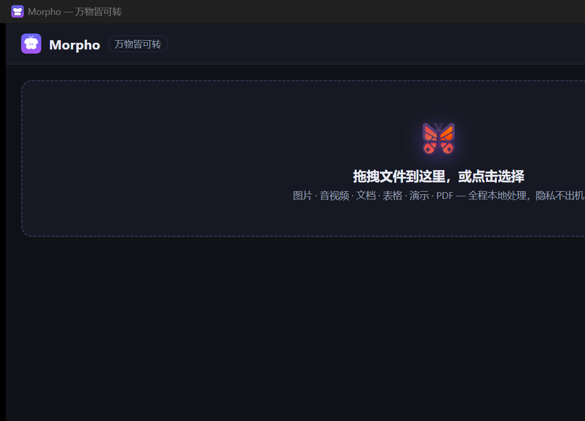

<div align="center">

# 🦋 Morpho — 万物皆可转

**本地、极速、隐私优先的全格式转换器。** 图片 · 音视频 · 文档 · 表格 · 演示 · PDF · OCR

[English](#english) | [中文](#中文)

</div>



---

<a name="中文"></a>

## 为什么是 Morpho

市面上的转换器要么把你的文件上传到别人的服务器，要么是数百 MB 的 Electron 套壳。Morpho 的答案：

- 🔒 **100% 本地处理** — 无网络请求、无遥测、无账号。文件永远不离开你的电脑。
- ⚡ **Rust 核心** — 原生性能，多任务并行转换，逐文件实时进度，随时取消。
- 🧰 **六引擎合一** — 内置 FFmpeg、LibreOffice、Poppler、Tesseract、Pandoc、qpdf，装完即用，零环境配置。
- 🖥️ **GUI + CLI** — 同一个引擎内核：图形界面给日常使用，`morpho` 命令行给自动化脚本。
- 🌍 **中英双语** · 深浅主题 · 免安装便携版
- 📜 **MIT 协议** — 个人与企业均可自由使用。

## 功能矩阵

| 类别 | 输入 | 输出 |
|---|---|---|
| 图片 | png jpg webp gif bmp tiff ico avif heic | png jpg webp gif bmp tiff ico avif · pdf · txt(OCR) |
| 视频 | mp4 mkv webm mov avi m4v wmv flv | mp4 mkv webm mov avi m4v wmv flv · gif(两遍调色板高清) · mp3/m4a 等提取 · 首帧图片 |
| 音频 | mp3 wav flac ogg opus m4a aac | 全组互转 |
| 文档 | doc docx odt rtf txt md html epub | pdf docx odt rtf html md epub txt |
| 表格 | xlsx xls ods csv | xlsx csv pdf ods html |
| 演示 | pptx ppt odp | pdf |
| PDF | pdf | txt(可保留版面) · png/jpg(逐页) · docx/html/md(文字链路) · 合并 · 拆分 · AES-256 加解密 |
| OCR | 图片扫描件 | txt（eng + chi_sim） |

命令行查看实时矩阵：`morpho formats`（逐格式列出全部可行目标）。

## 安装

从 [Releases](../../releases) 下载：

- `Morpho_0.1.0_x64-setup.exe` — Windows 安装版（NSIS，当前用户安装，无需管理员）
- 引擎全部内置，安装即可离线使用

## 命令行

```bash
morpho convert *.png --to webp              # 批量图片
morpho convert clip.mov --to mp4 --preset web   # 视频压缩预设: wechat | web | archive
morpho convert report.docx --to pdf --out ~/docs
morpho formats docx                          # 查询 docx 能转什么
morpho engines                               # 检查引擎状态
morpho pdf merge a.pdf b.pdf -o merged.pdf   # PDF 工具
morpho pdf split book.pdf -o pages/
morpho pdf encrypt secret.pdf -p 密码
```

## 从源码构建

```bash
# 0) 依赖: Node 18+, Rust 1.77+, Python 3 (引擎下载脚本)
npm install
python scripts/fetch_engines.py   # 下载 FFmpeg/LibreOffice/Poppler/Tesseract/Pandoc/qpdf 到 engines/
npm run tauri build               # 产出 NSIS 安装包
npm run tauri dev                 # 开发模式
```

## 架构

```
crates/morpho-engine   纯 Rust 转换引擎（GUI 与 CLI 共用）
  ├─ 图片管线          image crate，纯本地零依赖
  ├─ 音视频管线        FFmpeg sidecar，-progress 实时进度，两遍 GIF 调色板
  ├─ 文档管线          LibreOffice headless（独立 profile 隔离）
  ├─ PDF 管线          Poppler + qpdf
  ├─ OCR 管线          Tesseract（eng+chi_sim）
  └─ 队列              tokio 并行 + 信号量并发上限 + 广播事件 + 协作取消
crates/morpho-cli      命令行入口
src/                   Tauri 2 前端（Vite + TypeScript，零框架）
src-tauri/             Tauri 主进程（IPC、事件桥、缩略图、历史）
scripts/               引擎获取 / 图标生成
```

## Roadmap

- [ ] 相机 RAW 解码（cr2/cr3/nef/arw/dng）
- [ ] PDF → Word 版式还原引擎
- [ ] 视频 → 图片序列帧 / 图片 → 幻灯片视频
- [ ] 自动更新器 + 代码签名
- [ ] macOS / Linux 官方包

## 对比

| | Morpho | 飞鼠格式 | 在线转换站 |
|---|---|---|---|
| 文件上传云端 | ❌ 永不 | ❌ | ✅ |
| 批量并行 + 实时进度 | ✅ | 部分 | 视网站 |
| CLI 自动化 | ✅ | ❌ | ❌ |
| 许可证 | MIT | 非商用自定义 | — |
| 引擎 | Rust + 6 sidecar | Electron + 5 | — |

---

<a name="english"></a>

## Why Morpho

Most converters either upload your files to someone else's server, or are
hundreds of megabytes of Electron. Morpho's answer:

- 🔒 **100% local** — no network calls, no telemetry, no accounts. Files never leave your machine.
- ⚡ **Rust core** — native speed, parallel batch jobs, per-file live progress, instant cancel.
- 🧰 **Six engines, one installer** — FFmpeg, LibreOffice, Poppler, Tesseract, Pandoc and qpdf bundled; zero environment setup.
- 🖥️ **GUI + CLI** — one engine kernel behind both.
- 🌍 **English & 中文** · dark/light · portable-friendly.
- 📜 **MIT licensed** — free for personal and commercial use.

See the matrix and CLI examples above. Build from source:

```bash
npm install
python scripts/fetch_engines.py
npm run tauri build
```

## License

MIT © 2026 Morpho contributors. Bundled engines keep their own licenses
(FFmpeg LGPL/GPL build config, LibreOffice MPL-2.0, Poppler GPL-2.0,
Tesseract Apache-2.0, Pandoc GPL-2.0+, qpdf Apache-2.0/Artistic). Morpho
invokes them as separate executables.
